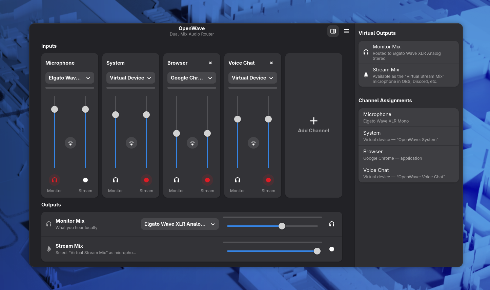

# OpenWave

A dual-mix virtual audio mixer for Linux, built with GTK4/libadwaita on top of
PipeWire. OpenWave routes your microphone, applications, and virtual devices
into two independent mixes — inspired by Elgato Wave Link, but without
requiring any specific hardware.



## The dual-mix concept

Every input channel has **two independent faders**:

- **Monitor Mix** — what *you* hear. Routed to a hardware output of your
  choice (headphones, speakers).
- **Stream Mix** — what *your audience* hears. Exposed as a virtual
  microphone called **“Virtual Stream Mix”** that you select as the input
  device in OBS, Discord, Zoom, or any other application.

This lets you, for example, listen to music loudly while streaming it
quietly, or hear a voice chat that never reaches your stream at all.

An optional third mix — the **VOD Mix**, enabled from the main menu — adds a
third fader per channel and a second virtual microphone, **“Virtual VOD
Mix”**. In OBS, assign *Virtual Stream Mix* to your live track and *Virtual
VOD Mix* to the recording track, then pull the Music channel to zero on the
VOD fader: your live audience hears the music, while your VOD/recording
stays free of DMCA-problematic audio.

## Features

- **Dynamic input channels** (up to 8): starts with *Microphone* and
  *System*; add more (Game, Music, Voice Chat, Browser, SFX, Aux, or custom
  names) with the **+** card, remove them again anytime.
- **Three kinds of channel inputs:**
  - *Capture sources* — microphones, line-ins, or monitors of other devices.
  - *Applications* — running playback streams, matched by application name
    and moved into the channel automatically.
  - *Virtual devices* — the channel appears as a selectable output device
    named `OpenWave: <channel>`. Point Discord's output at
    `OpenWave: Voice Chat`, or set `OpenWave: System` as your system default
    output; OBS can also capture these devices directly ("Audio Output
    Capture (PulseAudio)").
- **Per-channel effects**: insert **VST2/VST3 and LV2 plugins** (noise
  suppression, gates, compressors, EQs, …) on any input — browsed, ordered,
  bypassed, and tweaked with live parameter sliders entirely inside
  OpenWave's own UI. Effects are applied before the monitor/stream split,
  so both mixes hear the processed signal.
- **Per-channel, per-mix volume and mute**, with optional fader linking.
- **Optional VOD Mix**: a third bus (“Virtual VOD Mix”) for a second OBS
  audio track, so music can play live but stay out of the VOD/recording.
- **Master volume and mute** for every mix, plus live level meters
  everywhere.
- **MIDI controllers**: right-click any fader or mute button and move a
  knob, fader, or pad to bind it (MIDI learn). Binding *profiles* turn a
  pad controller into a bank switcher, LED feedback mirrors mute and
  profile state on the hardware, and fader pickup prevents volume jumps
  after switching profiles. Controllers are hotplugged automatically.
- **D-Bus control API** on the session bus: set volumes, toggle mutes, and
  switch MIDI profiles from scripts, hotkey daemons, stream-deck software,
  or desktop widgets — no plugins required.
- **Self-healing routing**: OpenWave re-applies volumes and re-attaches
  streams if the session manager moves them, and cleans up stale devices
  from crashed sessions on startup.
- **Background operation**: closing the window keeps the virtual devices
  running; enable *Start at Login* in the main menu and OpenWave launches
  hidden on login, so your audio setup is always ready.
- Configuration persists across restarts at
  `~/.config/openwave/config.json`.

## Requirements

- Linux with **PipeWire** and its PulseAudio compatibility layer
  (`pipewire-pulse`) — the default on Fedora, Ubuntu 22.10+, and most
  current distributions.
- **GTK 4.18+** and **libadwaita 1.8+**.
- WirePlumber (or another PipeWire session manager).

Optional, for effects:

- **LV2 chains** need PipeWire's filter-chain LV2 support and the lilv
  library — on Fedora: `sudo dnf install pipewire-module-filter-chain-lv2
  lilv` — plus some LV2 plugins (`lsp-plugins-lv2` is a great start; the
  RNNoise-based `noise-suppression-for-voice` is popular for microphones).
  On Debian/Ubuntu the LV2 loader ships with PipeWire itself; install
  `liblilv-0-0` and e.g. `lsp-plugins-lv2`.
- **VST plugins** need **Carla** (`sudo dnf install Carla` / `sudo apt
  install carla`) and Python 3: OpenWave hosts VSTs headlessly through
  Carla's engine library — you never see or use Carla itself. Plugins are
  discovered in `~/vst`, `~/.vst`, `~/.lxvst`, `~/.vst3`, the system
  `vst`/`vst3` folders, and `$VST_PATH`/`$VST3_PATH`.

## Installing

### Fedora (COPR) — coming soon

```sh
sudo dnf copr enable ghostzero/openwave
sudo dnf install openwave
```

### Arch Linux (AUR) — coming soon

```sh
yay -S openwave        # or paru -S openwave, or build manually:
git clone https://aur.archlinux.org/openwave.git && cd openwave && makepkg -si
```

### From source

Build dependencies (Fedora):

```sh
sudo dnf install gtk4-devel libadwaita-devel pulseaudio-libs-devel alsa-lib-devel
```

Build dependencies (Debian/Ubuntu):

```sh
sudo apt install libgtk-4-dev libadwaita-1-dev libpulse-dev libasound2-dev
```

Then:

```sh
make            # cargo build --release
make install    # installs to ~/.local by default
```

`make install` places the binary, the desktop entry, and the app icon under
`$(PREFIX)` (default `~/.local`); pass `PREFIX=/usr/local` for a system-wide
install. Make sure `~/.local/bin` is on your `PATH`, then launch **OpenWave**
from your app grid, or run `openwave` directly. `make uninstall` removes
everything again.

## Quick start

1. Start OpenWave. It creates the virtual devices automatically.
2. Assign your microphone to the *Microphone* channel.
3. Set `OpenWave: System` as your default output in system sound settings so
   desktop audio flows through the *System* channel.
4. In OBS/Discord, select **“Virtual Stream Mix”** as the microphone.
5. Pick your headphones as the *Monitor Mix* output device in the Outputs
   section — and mix away.

### Effects

Click the puzzle-piece button on a channel strip to open its effects.
*Add VST Plugin…* lists the VST2/VST3 plugins found in your plugin folders;
*Add Effect…* lists your installed LV2 plugins. Every plugin can be
reordered, bypassed, and tweaked with live parameter sliders right in the
dialog. VST plugins with their own editor also get a window button that
opens the plugin's native UI — edits made there are synced back and the
full plugin state is saved when the window closes. The VST rack processes
first, then the LV2 chain; everything is restored automatically on the
next start.

### MIDI controllers

Connect any class-compliant MIDI surface (fader banks, pad controllers,
keyboards with knobs) and **right-click a fader or mute button** — then
move the physical control to bind it. Bindings live in *profiles*
(**Main Menu → MIDI Controllers…**): bind pads to profiles and one small
pad controller can switch between, say, a *Monitor* layer, a *Stream*
layer, and a per-channel layer for its faders. Pads bound to mutes and
profiles light up to mirror the current state (the lit/dark velocities
are configurable, which selects the color on many pad controllers), and
*fader pickup* keeps a fader inert after a profile switch until it
crosses the current level. Everything is stored per controller name, so
bindings survive replugging.

### Scripting via D-Bus

OpenWave exports `de.ghostzero.OpenWave.Mixer1` at
`/de/ghostzero/OpenWave/Mixer` on the session bus while it runs —
usable from GNOME/KDE custom shortcuts, stream-deck tools, status-bar
widgets, or plain shell scripts:

```sh
# What channels exist?
gdbus call --session --dest de.ghostzero.OpenWave \
  --object-path /de/ghostzero/OpenWave/Mixer \
  --method de.ghostzero.OpenWave.Mixer1.ListChannels

# Cough button: toggle the microphone in the stream mix (channel id 1)
gdbus call --session --dest de.ghostzero.OpenWave \
  --object-path /de/ghostzero/OpenWave/Mixer \
  --method de.ghostzero.OpenWave.Mixer1.ToggleChannelMute 1 stream

# Set the monitor master volume to 50%
gdbus call --session --dest de.ghostzero.OpenWave \
  --object-path /de/ghostzero/OpenWave/Mixer \
  --method de.ghostzero.OpenWave.Mixer1.SetMasterVolume monitor 0.5
```

`GetVolumes` returns the whole mixer state as JSON, and the
`StateChanged` signal fires (debounced) after any change — subscribe and
re-query to keep an external display in sync.

## How it works

OpenWave talks to PipeWire through the PulseAudio client API on the GTK main
loop. It creates one null-sink bus per mix (`OpenWave_Monitor`,
`OpenWave_Stream`, and `OpenWave_Vod` when the VOD Mix is enabled), routes
every channel through one loopback stream per mix (each carrying its own
volume and mute), exposes the stream and VOD buses as real capture devices
via remap sources, and drives the level meters with low-rate peak-detect
streams. All streams carry unique names and opt out of
session-manager volume/target restoring, so the routing stays exactly as
configured.

Effect chains run out-of-process: each channel with effects gets a small
`pipewire -c` child hosting a `filter-chain` module (sink in, source out),
generated from your chain at `~/.config/openwave/fx/`. LV2 parameter changes
are applied live via `pw-cli set-param`. VST plugins are hosted by another
helper child (`vsthost.py`, driving Carla's engine library headlessly over a
JSON pipe) that appears as a JACK client and is wired in with `pw-link`;
plugins are probed once with `carla-discovery-native` and cached in
`~/.cache/openwave/vst-scan.json`. A crashing plugin can't take OpenWave
down — the channel falls back to its direct wiring.

## License

MIT
